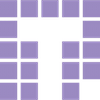

# Obsidian Server

## Welcome
Obsidian Server is a database-agnostic server application that provides a standardized, documented interface for common client-server tasks (e.g. user authentication, CRUD operations on records). 

## Table of Contents

* [Getting Started](./doc/getting_started.md)
* [Resources](./doc/resources.md)
* [Relationships](./doc/relationships.md)
* [Querying](./doc/querying.md)
* [Authentication](./doc/authentication.md)
* [API](./doc/api.md)
* [Advanced Configuration](./doc/configuration.md)
* [Adding Custom Functionality](./doc/custom.md)

## Getting Help

Please direct all bugs, feature requests, and other concerns to Nick Lee <nick@tendigi.com>

## License

Obsidian Server is released under the MIT license. See LICENSE for details.